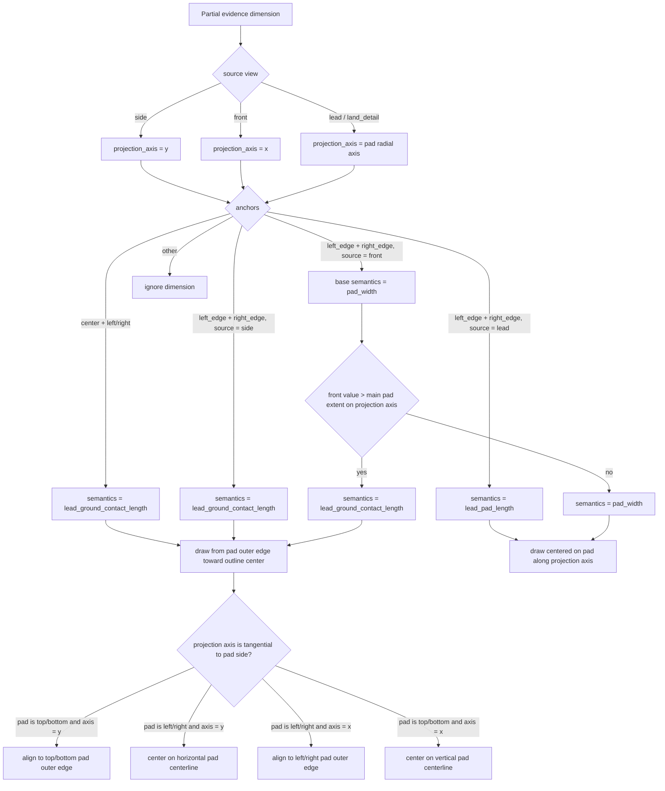

# Lead Pad Projection Rules

This document describes the current deterministic rules used by the final
comparison review gallery when projecting partial evidence from `side`,
`front`, `lead`, and `land_detail` views onto top/bottom/land package pads.

The output is display evidence only. It does not change GT alignment or model
predictions.

## Coordinate Convention

- Main-view graph coordinates come from the selected top/bottom/land package
  graph.
- `x` means horizontal in the main-view overlay.
- `y` means vertical in the main-view overlay.
- Dimension values are physical units.
- Graph unit scale is physical units per reconstructed graph pixel.

## Flowchart

## Current Practical Meaning

- `side` is treated as a vertical-length evidence source.
  - Example: if a package pad is on the left/right side of the outline,
    side-view evidence still draws a vertical lead pad length centered on the
    pad horizontal centerline.
  - Example: if a package pad is on the top/bottom side of the outline,
    side-view evidence draws a vertical lead pad length aligned to the top or
    bottom pad outer edge.
- `front` is treated as a horizontal-length evidence source.
  - If the front dimension is larger than the visible top/bottom pad width,
    the gallery treats it as contact length hidden under the package body.
    The new lead pad aligns with the original pad outer edge and extends inward.
- `lead` and `land_detail` remain radial by default because they can describe
  local detail rather than a global side/front orientation.

## Known Risk

These rules are deterministic heuristics for review visualization. If a future
case uses `side` to describe a true horizontal pad width, the current rule will
draw it vertically and should be split with an additional classifier.
